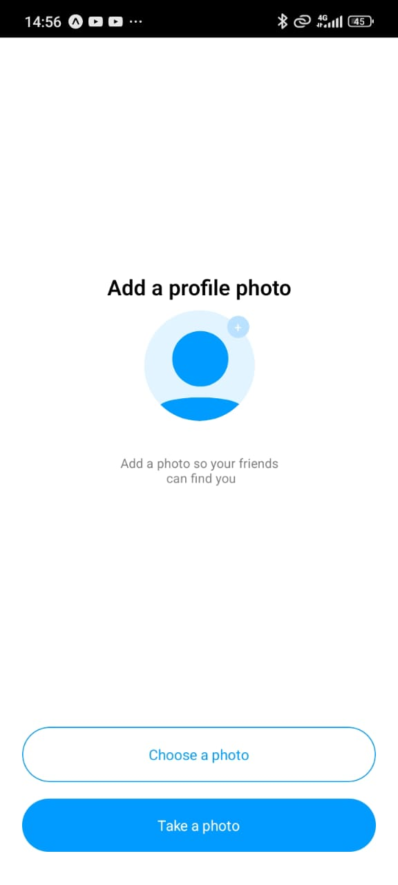
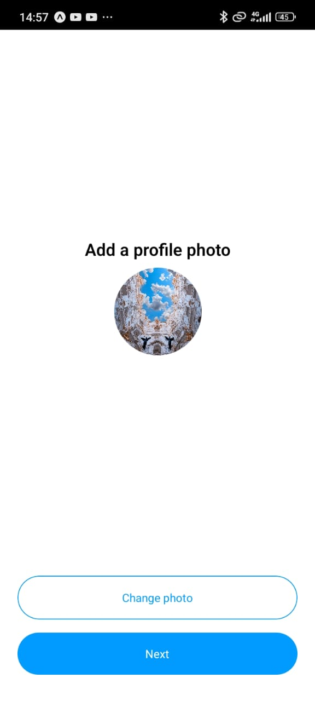
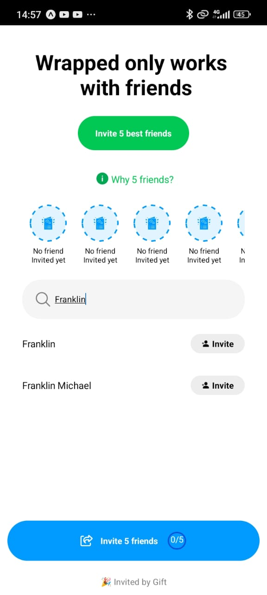
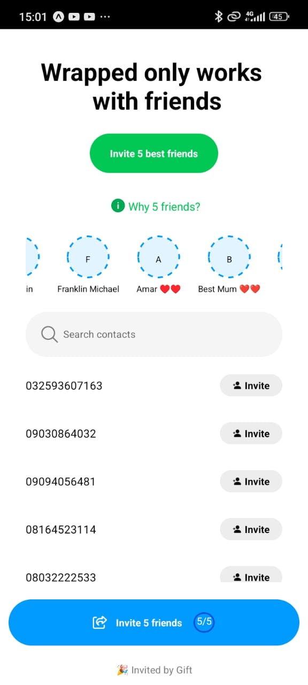

# React Native Wrapped

Display and manage a contact list
Implement a ranking system for contacts based on user interactions and engagement metrics
Securely upload profile images to cloudinary
Generate and share invite links to contacts via iMessage or massage

Additional features:

- [Expo Router](https://docs.expo.dev/routing/introduction/) file-based navigation and API Routes
- [Expo sms](https://docs.expo.dev/versions/latest/sdk/sms/) sending SMS messages
- [Expo Contact](https://docs.expo.dev/versions/latest/sdk/contacts/) provides access to the device's system contacts
- [Expo Svg](https://docs.expo.dev/versions/latest/sdk/svg/) A library that allows using SVGs in your app
- [cloudinary](https://cloudinary.com/home/) for uploading image

## Screenshots

